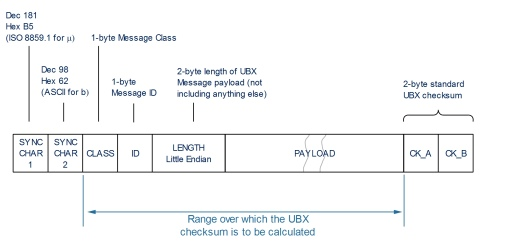

# Parser for UBX messages
Parser for NAV msgs in UBX protocol

### Supported messages types

- [x] HPPOSECEF - High-Precision coordinates in ECEF system.
- [x] HPPOSLLH - High-Precision Langtitude and Longtitude.
- [x] POSLLH - Langtitude and Longtitude.
- [x] POSECEF - Coordinates in ECEF system.

| MSG_ID        | MSG_STRUCTURE  |
| ------------- |:-------------:|
| HPPOSECEF     | Parser::res = {HP_ECEFX, HP_ECEFY, HP_ECEFZ} |
| HPPOSLLH      | Parser::res = {HP_LON, HP_LAT}               |
| POSECEF       | Parser::res = {ECEFX, ECEFY, ECEFZ}          |
| POSLLH        | Parser::res = {LON, LAT}                     |
